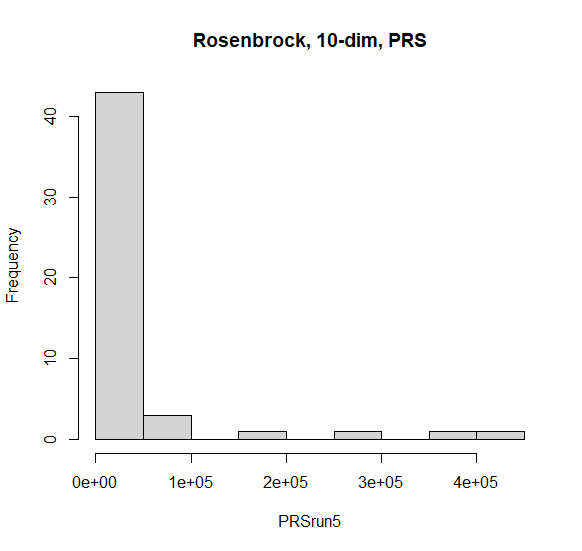

# RPiS_2022_Ember_Distaff
Autorzy: Ewelina Badeja, Piotr Kądziela

  Projekt miał na celu porównanie dwóch algorytmów do znajdowania minimum: PRS (Pure Random Serach) i GA (Genetic Algorithm). Zgodnie z oczekiwaniami GA dał lepsze wyniki, jednak PRS potrzebował znacznie  czasu na obliczenia (czas na wykonanie wszystkich obliczeń przez RS był rzędku kilku sekund, a przez GA kilku minut).
  Program został napisany w języku R, z wykorzystaniem funkcji Schwefela i Rosenbrocka jako funkcji testowych. Wykorzystaliśym implementacje tych funkcji z biblioteki smoof.
  
 ------------UWAGA!!!!!!!!!!---------------
 
    W bibliotece smoof w funkcji Michalewicza jest błąd. Funkcja niezależnie od ilości wymiarów zawsze żąda dwuelementowego wektora współrzędnych. Nie przeszkadza to przy funkcji Michalewicza dla 2 wymiarów, jednak dla 10 funkcja nie jest w stanie przyjąć poprawnego (10-elementowego) wektora.
    BŁąd został przez nas zgłoszony na oficjalnym githubie biblioteki.
    
--------------------------------------------
  
 
 
> mean(GArun1)
[1] -837.9528
> mean(PRSrun1)
[1] -343.6744

 
 
> mean(GArun2)
[1] -4186.097
> mean(PRSrun2)
[1] -1736.445

> mean(GArun3)
[1] -8257.089
> mean(PRSrun3)
[1] -3727.947

> mean(GArun4)
[1] 0.0007437699
> mean(PRSrun4)
[1] 16486.75

> mean(GArun5)
[1] 12.78813
> mean(PRSrun5)
[1] 36054.52

> mean(GArun6)
[1] 56.99735
> mean(PRSrun6)
[1] 164054.7

